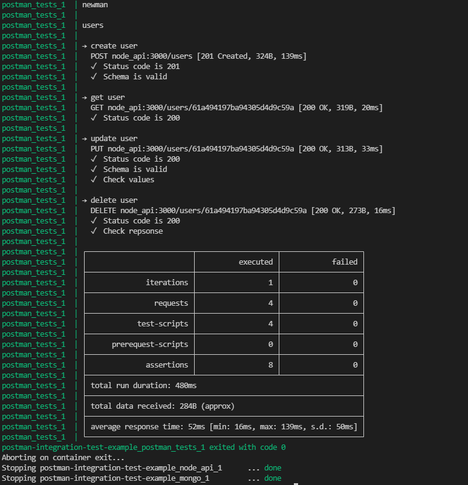

# Postman integration test example
An example node project with basic infrastructure for automating postman integration tests.

## Project structure
This project consists of the following parts:
1. simple node api located at `/api` folder
2. mongo db which the api is talking to. mongoose model is at `/api/models` folder
3. postman tests + environments are at `/postman` folder
4. `docker-compose` that knows how to run everything together

## Running
### Run integration tests
Use 
```bash
docker-compose up --abort-on-container-exit
```
or, if you want to rebuild on each run:
```bash
docker-compose up --build --abort-on-container-exit
```

### Output


After tests finished, you use standard shell/bash command: `$?` to get the last exit code, this is particularly usefull when running in CI environment.

### Run with `npm`
There's also an npm [newman](https://www.npmjs.com/package/newman) module, that is useful for quick runs during development.
Use 
```bash
npx newman run postman/collections/users.postman_collection.json \
-e postman/environments/local.postman_environment.json
```

### Run api
Use `docker-compose up node_api` to test the api.

Or, start mongo contaier with `docker-compose up mongo`, and then run api with `node server.js`